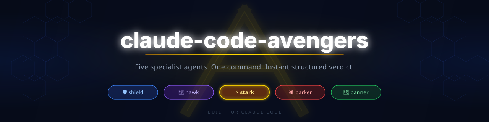
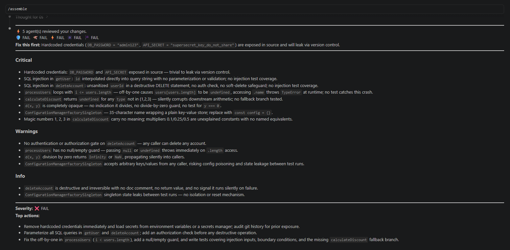

<div align="center">



[](LICENSE)
[](http://makeapullrequest.com)
[](https://claude.ai/code)
[](#agents)
[](https://github.com/HassanAbdullahHere/claude-code-avengers/stargazers)



</div>

---

## What is this?

`/assemble` spawns five specialist AI reviewers **in parallel** inside Claude Code. Each agent sees your code through a different lens. A synthesis agent then consolidates their findings — deduplicated, ranked by severity — into one clean, actionable report.

No separate tool. No pipeline. No config. One slash command.

---

## Agents

| | Agent | Reviews for |
|--|-------|-------------|
| 🛡️ | **shield** | Logic errors, edge cases, off-by-ones, broken contracts |
| 🦅 | **hawk** | SQL injection, exposed secrets, trust boundary violations |
| ⚡ | **stark** | Over-engineering, bad abstractions, unnecessary complexity |
| 🕷️ | **parker** | Confusing names, magic numbers, undocumented surprises |
| 🏴 | **banner** | Untested paths, missing edge cases, uncovered failure modes |

---

## Install

**Global** — available in every project on your machine:

```bash
git clone https://github.com/HassanAbdullahHere/claude-code-avengers.git
cd claude-code-avengers && bash install.sh --global
```

**Per-project** — scoped to one repo:

```bash
bash /path/to/claude-code-avengers/install.sh
```

> Requires [Claude Code](https://claude.ai/code) and Git.

---

## Usage

```bash
/assemble                # review your uncommitted changes
/assemble src/auth.ts    # review a specific file
/assemble --full         # review the entire codebase
```

**Focus modes** — run only the agents you need:

```bash
/assemble --security     # hawk only    — fast security scan
/assemble --quick        # shield+hawk  — correctness and security
/assemble --design       # stark+parker — design and readability
```

---

## Output

Every run gives you:

- **Scoreboard** — all agent verdicts at a glance: `🛡️ PASS  🦅 FAIL  ⚡ WARN  🕷️ PASS  🏴 WARN`
- **Fix this first** — the single most critical finding, isolated at the top
- **Findings by severity** — Critical → Warnings → Info, deduplicated across all agents
- **Top 3 actions** — what to fix, in order of severity

When everything passes: `✅ All clear. No actions required.`

---

## How it works

```
/assemble
    │
    ├── 🛡️ shield ──┐
    ├── 🦅 hawk   ──┤
    ├── ⚡ stark  ──┼──▶  verdict  ──▶  you
    ├── 🕷️ parker ──┤
    └── 🏴 banner ──┘
         (parallel)
```

1. Gathers your git diff (or the file you specify)
2. Spawns all five agents **simultaneously** — no waiting
3. Each returns severity-tagged bullets: `[C]` critical · `[W]` warn · `[I]` info
4. Verdict agent deduplicates and ranks by severity
5. One clean report lands in your chat

---

## Contributing

Issues and PRs welcome. Keep agent prompts focused — hard cap is 100 words.

**Adding a new agent:**
1. Create `.claude/agents/<name>.md` with a system prompt (≤100 words)
2. Register it in `assemble.md` under Step 2
3. Add it to the agents table in this README

Output format is defined in `.claude/agents/verdict.md` — change it there only.

---

<div align="center">

Made for [Claude Code](https://claude.ai/code) · [MIT License](LICENSE)

</div>
